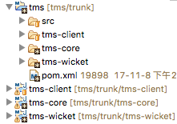
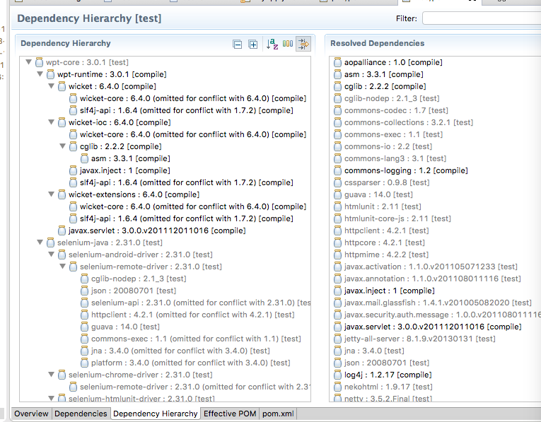
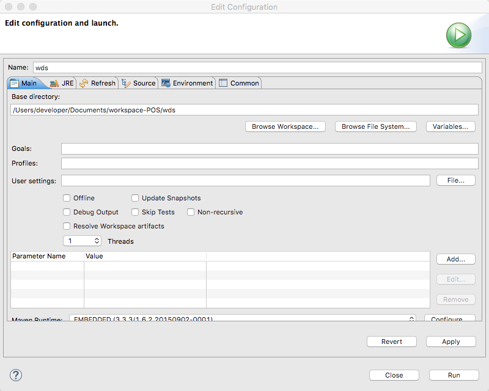
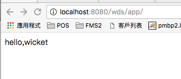
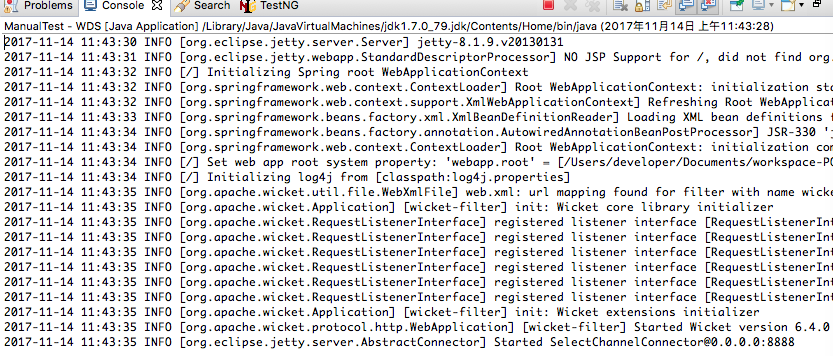

<h2 style="text-align:center" >wicket 6.4 开发手册</h2>

<div style="text-align:center"></img></div>

<h4 style="text-align:center">yabou</h4>
<h4 style="text-align:center">kyo</h4>

<div class="page-break"></div>

一、搭建开发环境及第一个页面

  首先下载eclipse,现在我使用的是eclipse Mars（4.5）,而最新的是eclipse Oxygen（4.7）可以前往http://www.eclipse.org/downloads/ 下载对应自己机器本的eclipse，注意64bit和32bit的区别（即64位和32位）。

  在下载期间，首先确定机器上已经有JDK或者JRE环境，（Java SE Development Kit或者Java SE Runtime Environment），windows上可以win＋R键呼出“运行”，然后输入“cmd”，输入“java －version”查看是否已经有JDK或者JRE环境，mac上同理，找到命令输入行，查看版本。如果没有，前往http://www.oracle.com/technetwork/java/javase/downloads/jdk8-downloads-2133151.html 下载。

  解压eclipse和安装jdk环境之后，确认eclipse上已经有安装maven，一般都会有，如没有可以前往菜单栏中HELP－>Eclipse Marketplace处，搜索Maven Integration for Eclipse下载安装即可。

  建议先前往Window－>Show View->Other，选择Package Explorer。而不是使用默认Project Explorer，方便查看项目。

  然后在其中，右键选择new－>other,在新弹出的窗口，输入maven搜索，选择maven project。进入到new maven project页面，勾选Create a simple project（因为国内功夫网的原因，如果不勾选，可能会卡死在搜索包的环节）。

  然后进入输入项目信息，Group Id 一般输入com.xxxx(xxx你所在的组织，或者你个人名称)，这里输入io.pisoft，其实是你这个包以后封装出来的名称，也可以随意输入。Artifact Id输入项目名称，这里输入WDS，意指Wicket Develop Study。Version输入版本号，这里输入0.0.1，packing选择war格式。如果要打包成jar包可以選擇jar包，如果是一個總項目下有幾個分項目，總項目選擇pom格式

  

  完了之后，可以发现项目中，pom.xml报错，查看Problems窗口可以看到报错描述缺少web.xml，

  因为缺少了web.xml配置文件，打开src->main->webapp,创建WEB-INF文件夹，在其中创建web.xml,内容先使用如下，可以前往http://www.cnblogs.com/hellojava/archive/2012/12/28/2835730.html ,了解web文件的配置

<div class="page-break"></div>

 ```xml
 <?xml version="1.0" encoding="UTF-8"?>
 <web-app version="2.4" xmlns="http://java.sun.com/xml/ns/j2ee"
 	xmlns:xsi="http://www.w3.org/2001/XMLSchema-instance"
 	xsi:schemaLocation="http://java.sun.com/xml/ns/j2ee
         http://java.sun.com/xml/ns/j2ee/web-app_2_4.xsd">
 	<context-param>
 		<param-name>contextConfigLocation</param-name>
 		<param-value>classpath:beans.xml</param-value>
 	</context-param>
 	<listener>
 		<listener-class>org.springframework.web.context.ContextLoaderListener</listener-class>
 	</listener>

 	<filter>
 		<filter-name>wicket-filter</filter-name>
 		<filter-class>org.apache.wicket.protocol.http.WicketFilter</filter-class>
 		<init-param>
 			<param-name>applicationClassName</param-name>
 			<param-value>io.pisoft.wds.page.MyApp</param-value>
 		</init-param>
 		<init-param>
 			<param-name>configuration</param-name>
 			<param-value>deployment</param-value>
 		</init-param>
 	</filter>

 	<filter-mapping>
 		<filter-name>wicket-filter</filter-name>
 		<url-pattern>/app/*</url-pattern>
 	</filter-mapping>
 </web-app>
 ```

 其中wicket-filter之中指定了applicationCLassName的值，应该是一个继承了org.apache.wicket.protocol.http.WebApplication的类，告诉wicket这个类是一个网页应用，这个应用的初始化都是在这里进行，这次我们要编写这个类，来设定我们的应用homePage。在这之前，我们先利用Maven导入我们需要依赖的jar包。

 那么该如何利用Maven导入依赖的包呢？
 打开项目，可以看到一个pom.xml文件，这个文件是Maven的配置文件,如果打开应该可以看到类似下的样子

```xml
 <project xmlns="http://maven.apache.org/POM/4.0.0" xmlns:xsi="http://www.w3.org/2001/XMLSchema-instance" xsi:schemaLocation="http://maven.apache.org/POM/4.0.0 http://maven.apache.org/xsd/maven-4.0.0.xsd">
  <modelVersion>4.0.0</modelVersion>
  <groupId>io.pisoft</groupId>
  <artifactId>wds</artifactId>
  <version>0.0.1</version>
  <packaging>war</packaging>
</project>
```
在这个文件中添加我们需要的依赖，这次添加

```xml
<project>
  ...
<packaging>war</packaging>

<dependencies>
  <dependency>
    <groupId>com.ttdev</groupId>
    <artifactId>wpt-core</artifactId>
    <version>3.0.1</version>
    <scope>test</scope>
  </dependency>
  <dependency>
    <groupId>org.slf4j</groupId>
    <artifactId>slf4j-log4j12</artifactId>
    <version>1.7.2</version>
    <type>jar</type>
    <scope>compile</scope>
  </dependency>
  <dependency>
    <groupId>com.ttdev</groupId>
    <artifactId>wpt-runtime-spring</artifactId>
    <version>3.0.1</version>
  </dependency>
</dependencies>

</project>
```

输入后保存可以在图形界面上观察到这三个依赖实际添加了哪些jar包。



接下来我们开始编写MyApp类

```java
public class MyApp extends WebApplication {

	@Override
	public Class<? extends Page> getHomePage() {
		return HomePage.class;
	}

	@Override
	protected void init() {
		super.init();
	}
}
```

其中继承了getHomePage页面，将其override为返回HomePage.class这个页面类。

接下来就是编写HomePage，我们这个页面。

首先在src/mian/java這個文件夾下創建包io.pisoft.wds.page，通常使用域名＋项目名称＋page来代表这个包下存放与页面有关的类，以后也会创建io.pisoft.wds.core存放实体类，及service方法。
创建HomePage.java

```java
import org.apache.wicket.markup.html.WebPage;
import org.apache.wicket.markup.html.basic.Label;
import org.apache.wicket.markup.html.link.Link;
import org.apache.wicket.model.CompoundPropertyModel;
import org.apache.wicket.model.Model;
import org.apache.wicket.model.PropertyModel;

public class HomePage extends WebPage {
	private static final long serialVersionUID = 1L;
	public HomePage() {
		add(new Label("text", "hello,wicket"));
	}
}
```

然后在src/mian/resources這個文件夾下創建包io.pisoft.wds.page,创建HomePage.html,一个很简单，只带有一个wicket:id的span

```html
<!DOCTYPE html>
<html>
  <head>
    <meta charset="utf-8">
    <title></title>
  </head>
  <body>
    <span wicket:id="hello"></span>
  </body>
</html>
```
要注意页面类和html要同名，区分大小写。

现在一个简单的网页就写完了，接下来就是要部署，一般现在都是会使用Tomcat，但是为了方便测试，我们也会使用jetty来测试我们的应用，jetty与tomcat一样是Servlet容器，但是比起tomcat更轻量级的感觉。

1，使用tomcat部署
首先要将项目打包成war包，右键项目，选择run as->maven build（带快捷键提示那个），打开如下界面



在Goals輸入package，然后选择skip Tests，点击run，之后控制台应该会显示带BUILD SUCCESS字样
信息

如果打包失败，如果不是命令错误，或者没有跳过测试，导致测试报错的话

    1、可以尝试输入install将项目加入本地.m2仓库，然后再package

    2、如还不行尝试run as－>maven clean,和选择eclipse上的菜单栏中的project－>clean，选择项目clean再尝试，

    3、尝试修改版本号

打包成功的话，可以在项目下的target文件夹下看到war文件。将其名字从wds－0.0.1.war改成wds.war

将其拷贝到tomcat下的webapps下，然后通过命令行进入bin文件夹下启动startup.sh，这样应该就能通过
http://localhost:8080/wds/app/ 访问到



2，使用jetty服务器

在src/test/java下创建io.pisoft.wds.func
包下创建ManualTest

 ```java
 public class ManualTest {
	public static void main(String[] args) {
		WebAppJettyLauncher launcher = new WebAppJettyLauncher();
		WebAppJettyConfiguration cfg = new WebAppJettyConfiguration();
		launcher.startAppInJetty(cfg);
	}
}
 ```

 这是pom中的wpt-core(wicket-page-test-core)，下的两个类，WebAppJettyLauncher是封装了jetty里面的Server类，并初步配置，然后WebAppJettyConfiguration封装了一些配置，例如端口，页面路径等，这里就是用默认的配置，运行ManualTest，等待Started SelectChannelConnector@0.0.0.0:8888出现

 

 之后就可以通过http://localhost:8888/app/
 进入。（app是因为我们在web.xml中的fileter设置），这是设置应用处理在哪个路径下的request，如果后面缺省的话，默认返回首页。

 ```
 <filter-name>wicket-filter</filter-name>
 <url-pattern>/app/*</url-pattern>
 ```

 如果不是首页的页面该如何进入呢？

 http://localhost:8888/app/wicket/bookmarkable/io.pisoft.pos.page.HomePage

 通过wicket/bookmarkable/+包名＋页面类来访问。

 也可以在MyApp中的init方法里面使用mountPage("home", HomePage.class)方法，把这个页面mount一下，就可以通过http://localhost:8888/app/home
访问。

**小结**

这一章学习了开发环境的搭建，及一个简单的页面的书写。下一章将学习开始学习wicket页面逻辑

<div class="page-break"></div>

二、wicket 页面逻辑

上一章HomePage页面是由页面类和html组成的，wicket首先通过HomePage这个类生成了HomePage object，即这个页面对象，然后通过添加component（组件）来决定生成。

我们可以认为HomePage类是一个底层，通过add方法可以在这个底层上面添加一个组件，当然add还可以添加行为及验证器，这里先按下不表。如果我需要在lable里面在嵌套一个组件，只需要在label.add()，追加组件即可，如果是学过java的awt，Swing之类的图形界面设计的应该能轻松理解wicket对页面操作与Swing之类是近似的。

模版html与页面类是通过wicket:id来联系的，类将会声明很多组件，然后通过add方法加进components数组里面，这样就会形成一个根是这个页面的组件树，然后通过一个个将这个组件替换模版html中的定下来的点，来形成一个动态生成的html。
